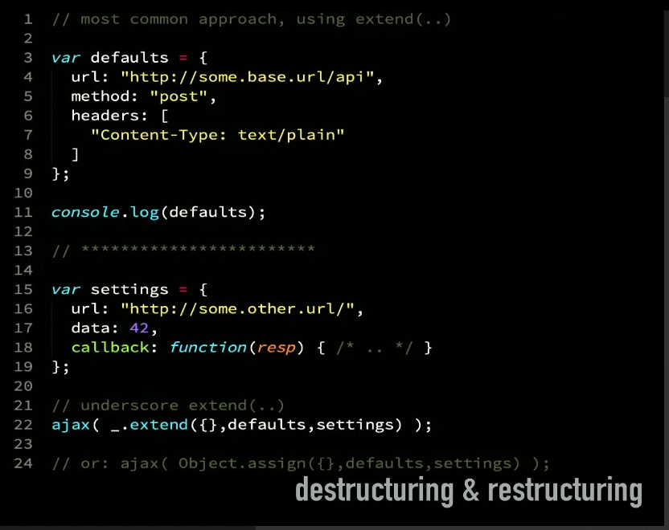
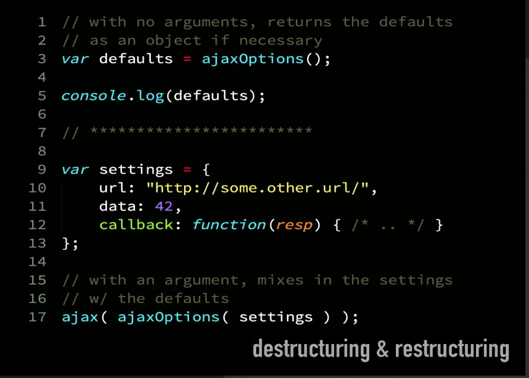

# Further Destructuring

## Named Arguments

```js
function loopupRecord(store = "person-records", id = -1) {
    // ..
}

// a good rule of thumb is any more than three parameters use this pattern, this means you are less likely to make a mistake with the order of the parameters.

function lookupRecord({
    store = "person-records",
    id = -1
}) {
    // ..
}

lookupRecord( {id: 42});
```

## Destructuring & Restructuring

_An advanved use case of destructuring_.

Common approach.



Destructure / restructure function approach.


Usage of above.


