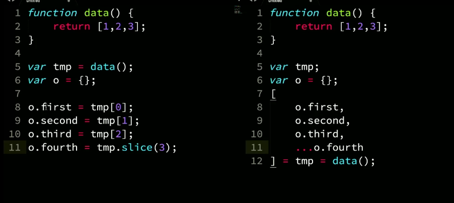
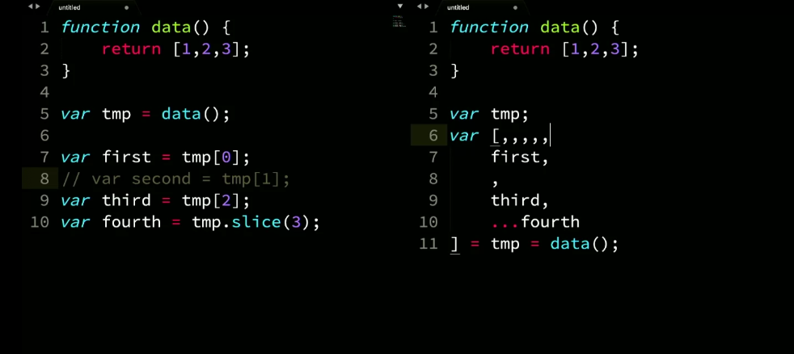
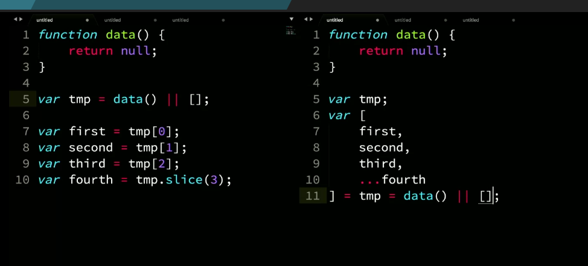
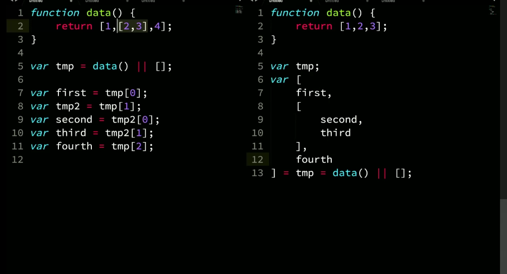

# Refactoring code using destructuring


## Conditionals

```js
function data() {
    return [1,2,3]
}

//imperative conditional
var tmp = data();
var three = tmp[2] !== undefined ? temp[2] : 10;

//declarative conditional
var [
    one,
    two,
    three = 10
] = data();
```

## Spread operator & declaring destructured arrays

If you need to access to the both the value and it's destructured parts, you chain an equals together.

```js
function data() {
    return [1,2,3];
}

var tmp;
var [
    one,
    two,
    three,
    ...four
] = tmp = data();
```

## Declaration & Assignment



## Comma separation



## Parameter arrays

```js
//with fallback to empty array
function data(tmp = []) {
    var [
        first,
        second,
        third
    ] = tmp
}

// or
function data([
    first,
    second,
    third
] = []) {
    // ..
}
```

Fallback to empty array;



## Nested array destructuring



With fallback:


