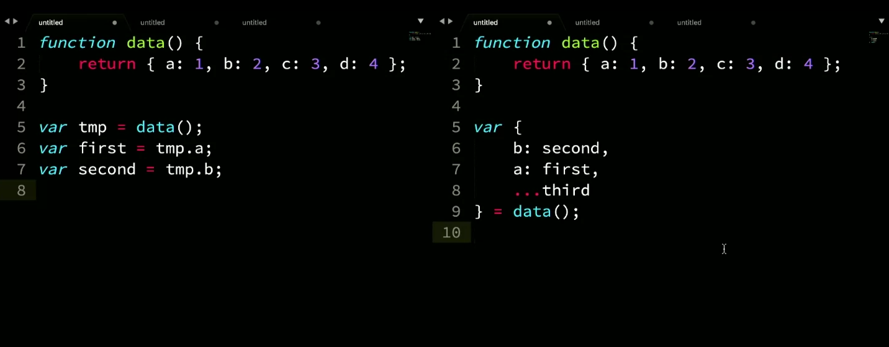

# Object Destructuring

```js
function data() {
    return { a: 1, b: 2, c: 3 };
}

//old
var tmp = data();
var first = tmp.a;
var second = tmp.b;
var third = tmp.c;

// destructured
var {
    a: first = 42,
    b: second,
    c: third
 } = data();

```

You can also spread desructured values.

```js
function data() {
    return { a: 1, b: 2, c: 3, d: 4 };
}

var tmp = data();
var first = tmp.a;
var second = tmp.b;
var third = tmp.c;

var {
    b: second,
    a: first,
    ...third
 } = data();
```

When thinking of object desructuring, the pattern follows _source_, _target_, _default_.

Can also pull more of an object and spread them into a new object.



If you already have variables declared, then you must wrap the destructuring code in parenthesis. This is to disambiguate between a desructuring pattern and a block.

```js
function data() {
    return { b: 2, c:3 , d:4 }
}

var tmp;
var first, second;
({
    b: second,
    a: first
}) = data());

//you could do the same with a tmp variable, because it wont be confused with a block...
tmp = {
    b: second,
    a: first
} = data();

```

## Object Default Assignment

```js
function data() {
    return;
}

//old 
var tmp = data() || {};
var a = tmp.a;
var b = tmp.b;

//destructured (if source and target are the same, dont need assignment so rather than "a: a" you can just use shorthand "a")
var {
    a = 42, //default to 42 if nothing there.
    b
} = data() || {};
```

## Nested Object Destructuring

```js
function data() {
    return {
        a: 1, 
        b: {
            c: 3,
            d: 4
        }
    }
}

//old
var tmp = data() || {};
var a = tmp.a;
var b = tmp.b;
var c = b.c;
var d = b.d;

//new 
var {
    a,
    b: {
        c,
        d
    }
} = data() || {};
```

## Parameter Objects

```js
//imperative
function data(tmp = {}) {
    var {
        a,
        b
    } = tmp;
    //...
}

// declarative
function data({
    a,
    b
}= {} ) {
    //..
    // if you don't need the initial object but only it's parts, this is the way to go, if you need the object, use the imperative way.
}
```

## Nested Object & Array Destructuring

